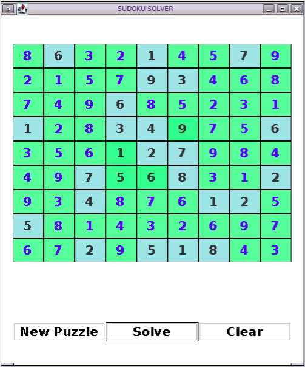

Hello there!

[!Play Live Here](https://replit.com/@prilily/SUDOKU?v=1)

This Sudoku Application allows you to choose your level and play.
For every cell you answer the color changes to accordingly.

- GREEN  ~ for correct cell value 
- RED    ~ your input > answer (greater than)
- CORAL  ~ for your input < answer (less than)

For playing different level choose New Game -> select level.

#### Main.java      
- the GUI for starting the game.

#### Generator.java 
- generates a sudoku filling the diagonal sub-box then filling the rest subblocks by utilizing fillValues() function.

#### Celldisplay.java  
- the GUI for sudoku. a cell panel with 9*9 textfields. each have a action listener SudokuCellKeyListener.

#### SudokuCellKeyListener.java  
- the class is the keyevent listener for the sudoku cells.

### SudokuansListener.java   
- ActionListener for solve button. it fills the remaining cells with answer when user presses solve button using BackTracking Algorithm

### FUTURE DEVELOPMENTS :
- solve sudoku by uploading image and processing with OpenCV